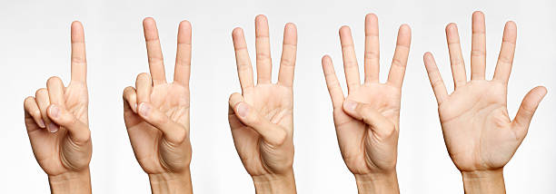

# User Manual
## Installation
### Latest Release: 
The extension can be downloaded from the chrome extension store once it has been published. 
#### Link to extension page: [placeholder]
### Source Code: 
1. Build the extension through the steps listed in the readme
2. Go to the chrome extension manager page which can be found at <chrome://extensions/>
3. Choose "Load unpacked"
4. Then select the "dist" directory inside the extension directory of the repository, this contains the newly built version of the extension

## Usage
### Getting Started: 
Once the extension is installed, the extension must be given webcam privileges. 
In the chrome extension manager, click on the details button for Manus. 
Once inside scroll down and click "Site settings". 
Then select "Camera" and chose "Allow". 
In order to enable the extension, you must open the extension popup by clicking on the extension icon. 
Then clicking on the button which says "begin inference" 
Then Manus had utility will be active on the current window. 

### Functionality: 
There are currently 5 supported gestures, which hard holding up 1-5: 

    

Each Gesture can be mapped to a corresponding function, which can be changed in the settings menu.

### Changing Mappings: 
The Mappings can be accessed by right clicking on the extension icon, this brings up the options page. 
Once on the options page, the mappings can be viewed from this page. 
Clicking on the action in the actions tab brings up a drop-down menu which allows you to select what action you want to map to this gesture. 